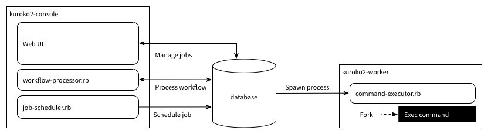

# Administrator Guide

## Components



### Web UI (Web console)

The Web UI (Web Console) is a rails application.


### Daemons

All kuroko2 daemons backend is [serverengine gem](https://github.com/fluent/serverengine).

Example systemd unit files are available [here](systemd).


#### job-scheduler


```bash
./bin/rails runner Kuroko2::Servers::JobScheduler.new.run
```

#### workflow-processor

```bash
./bin/rails runner Kuroko2::Servers::WorkflowProcessor.new.run
```

#### command-executor

```bash
./bin/rails runner Kuroko2::Servers::CommandExecutor.new.run
```

## Configuration

Kuroko2's configuration file is `config/kuroko2.yml`.

### url

A your Kuroko2 application URL.

```yaml
url: 'my.kuroko2.host.expample.com'
```

### action_mailer

The options to ActionMailer.
See detals in [Action Mailer Basics](http://guides.rubyonrails.org/action_mailer_basics.html#action-mailer-configuration) in Ruby on Rails Guides.

```yaml
action_mailer:
  delivery_method: 'smtp'
  smtp_settings:
    address: 'your.smtp.example.com'
    port:    25
    domain:  'example.com'
```

### custom_tasks

A hash table in the custom task name and class name.

```yaml
custom_tasks:
  custom_task1: CustomTaskClass
```

See details in [Adding custom tasks](#adding-custom-tasks).

### notifiers

Notifiers settings.
The `mail` option is required, others is optional.

```yaml
notifiers:
  mail:
    mail_from: 'no-reply@example.com>'
    mail_to: "kuroko+<%= Socket.gethostname %>@example.com"
  slack:
    webhook_url: 'https://localhost/test/slack'
```

### execution_logger

Select a execution logger storage and options.

Supporting storages are

- Void (Do nothing logger)
- Amazon CloudWatch Logs


```yaml
execution_logger:
  type: 'CloudWatchLogs'
  option:
    group_name: 'kuroko2'
```

### app_authentication

Authentication settings. it supports only Google OAuth.

```yaml
app_authentication:
  google_oauth2:
    client_id: '<%= ENV["GOOGLE_CLIENT_ID"] %>'
    client_secret: '<%= ENV["GOOGLE_CLIENT_SECRET"] %>'
    options:
      hd: '<%= ENV["GOOGLE_HOSTED_DOMAIN"] %>'
```

## Addtional configuration to Kuroko2::Servers::CommandExecutor

Environment variable  | Details                                               |  Required
----------------------|-------------------------------------------------------|-----------
HOSTNAME              | A hostname to display on Web UI.                      |  NO
QUEUE                 | A queue name to execute. Default value is "@default". |  NO
NUM_WORKERS           | The number of workers. Default value is 4.            |  NO

## Adding custom tasks

### 1. Create a custom task directory to your application

```bash
$ cd your_kurko2_rails_apps/
$ mkdir -p lib/kuroko2/workflow/task/
```

### 2. Put a custom task class in your custom task directory.

```ruby
module Kuroko2
  module Workflow
    module Task
      class MyProjectRunner < Execute
        def chdir
          '/home/alice/my_project'
        end

        def shell
          "bundle exec ./bin/rails runner -e production #{Shellwords.escape(option)}"
        end
      end
    end
  end
end
```

### 3. Add to `config/kuroko2.yml`

```yaml
custom_tasks:
  my_project_runner: MyProjectRunner
```

### 4. You can use custom task in job scripts.

```
env: VAL1=A
env: VAL2=B
my_project_runner: MyProject::Batch1.run
```

## Monitoring Kuroko2 stats

You can monitor the Kuroko2 statuses at below endpoints.

* /v1/stats/waiting_execution
* /v1/stats/instance

## How to upgrade Kuroko2

```bash
$ bundle update kuroko2
$ ./bin/rake kuroko2:install:migrations
$ ./bin/rake db:migrate
```
