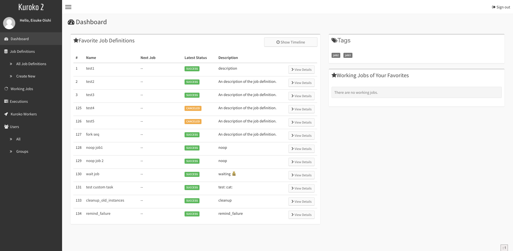
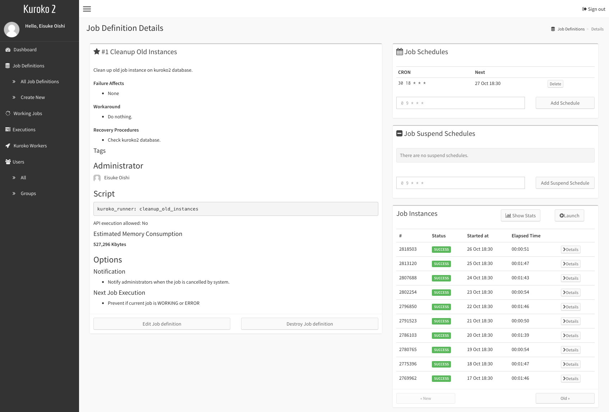
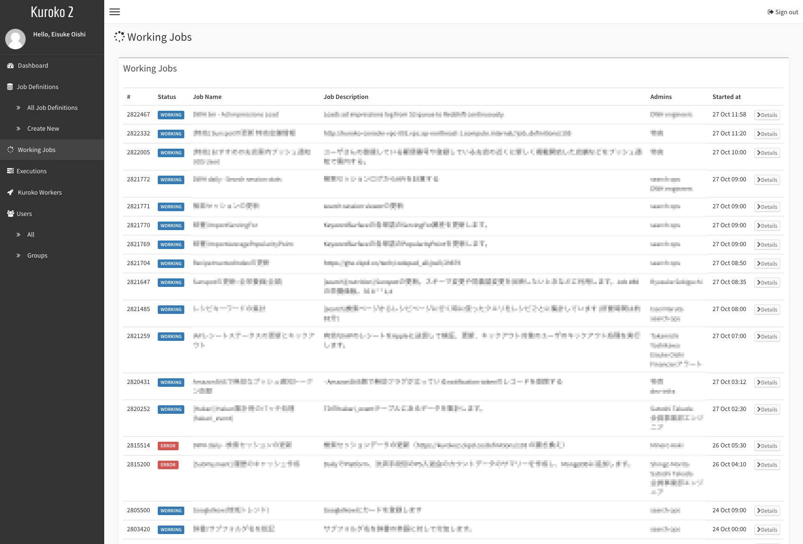
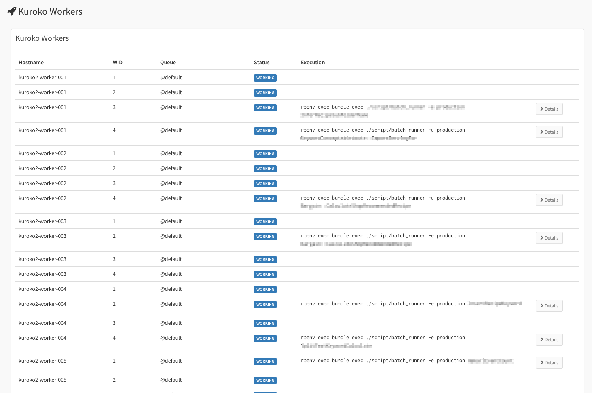
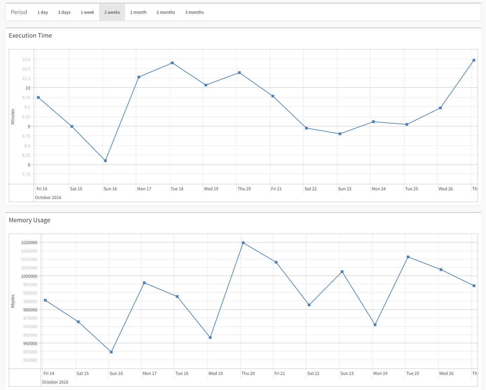
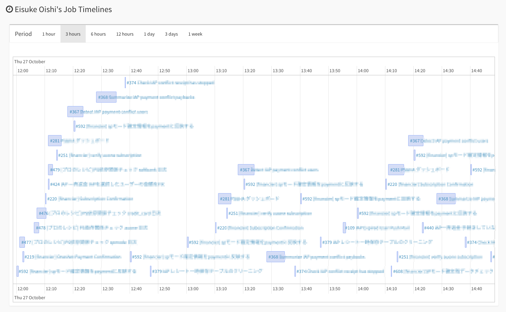

Kuroko2 is a web-based job scheduler / workflow engine created at Cookpad Inc.

# Overview

## System requirements

* Ruby >= 2.2
* Ruby on Rails >= 5.0.0.1
* MySQL >= 5.6

## Screenshots

Bookmarked jobs are summairsed on user dashboard



---

A job definition and job execution history.



---

Current running job can be seen.



---

Current running job per workers.



---

Job stats (Execution time and Memory usage) are available.



---

Bookmarked job are described with timeline



# Quick Start

## 1. Creating a new kuroko2 rails application

```bash
$ rails new my_kuroko2 --database=mysql --skip-turbolinks --skip-javascript -m https://raw.githubusercontent.com/cookpad/kuroko2/master/app_template.rb
```

## 2. Setting authenctication configuration

Kuroko2's authentication system supports only Google OAuth.

```bash
$ cd my_kuroko2/
$ vi .env
```

And adding variables to the `.env` file.

```
GOOGLE_CLIENT_ID=[client_id]
GOOGLE_CLIENT_SECRET=[secret]
GOOGLE_HOSTED_DOMAIN=[your hosted domain]
```

## 3. Starting daemons

```bash
$ foreman start
```

# [Administrator Guide](admin_guide.md)

# [User Guide](user_guide.md)

# Resources & links

* [クックパッドのジョブ管理システム kuroko2 の紹介 - クックパッド開発者ブログ (In Japanese)](http://techlife.cookpad.com/entry/2015/12/07/195732)
